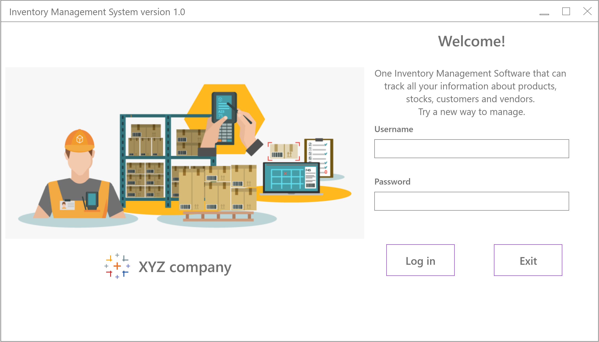
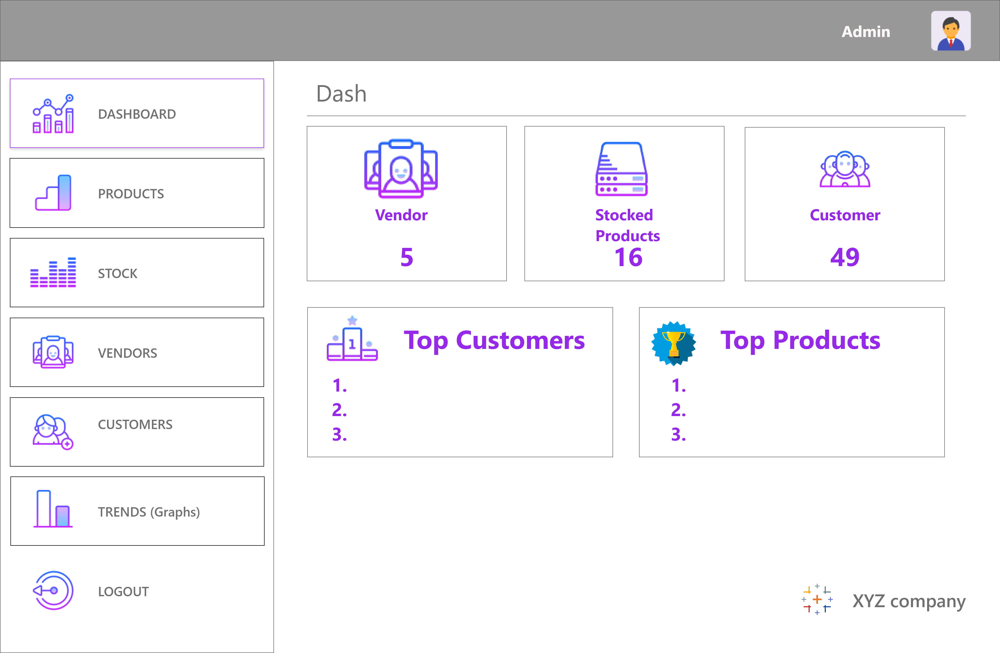
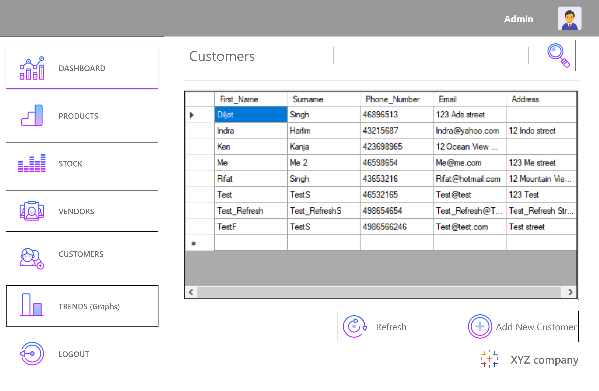

# Inventory Management System
This is a small inventory management system for small to medium business. The purpose of the project is to 
give stackholders a place to store information regarding their business and monitor through this application.
The project is based on few pages: 
1. Login 
2. Dashboard 
3. Products 
4. Stocks
5. Vendors 
6. Customers

The last 4 pages interact with the inventory database where you can add, remove, update or delete items from database. 

### UI preview
Some of the sample ui are attached below:

Screenshot: Login page

Screenshot: Dashboard page

Screenshot: Customers page

### Tools used in the project:
C# language, Winform, SQL server and Adobe XD (UI design).
